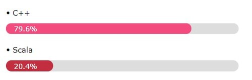

<!-- HTML/CSS -->
<meta name="viewport" content="width=device-width, initial-scale=1">
<link rel="stylesheet" href="https://www.w3schools.com/w3css/4/w3.css">

# Coding Test

**Study coding test.**

# Algorithm Website

- [**programmers**](https://programmers.co.kr/)
- [**HackerRank**](https://www.hackerrank.com/)

# Programming Language

<!-- Progress Bar

-->

---
**Updated :** 2021-09-12 00:09
